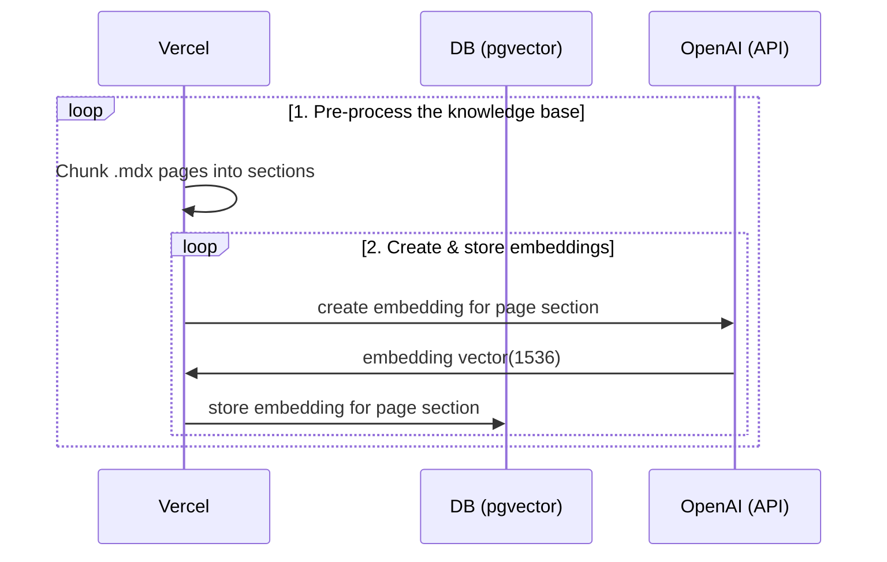
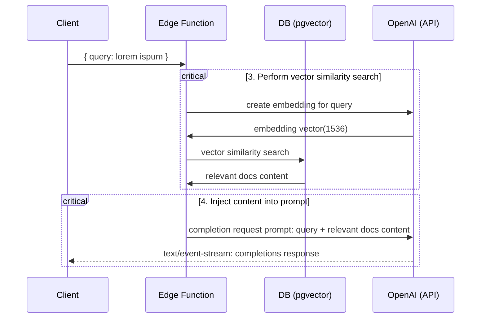

# Hyrox Q&A Bot - AI-Powered Information Assistant

This application provides an AI-powered Q&A bot that answers questions about Hyrox competitions, events, training, and general information. It uses OpenAI's API to provide instant answers based on official Hyrox website content and resources.

## Deploy

Deploy this Hyrox Q&A Bot to Vercel. The Supabase integration will automatically set the required environment variables and configure your [Database Schema](./supabase/migrations/20230406025118_init.sql). All you have to do is set your `OPENAI_KEY` and you're ready to go!

[

## Technical Details

Building your own custom AI fitness coach involves four steps:

1. [👷 Build time] Pre-process the knowledge base (your `.mdx` files in your `pages` folder).
2. [👷 Build time] Store embeddings in Postgres with [pgvector](https://supabase.com/docs/guides/database/extensions/pgvector).
3. [🏃 Runtime] Perform vector similarity search to find the content that's relevant to the question.
4. [🏃 Runtime] Inject content into OpenAI GPT-3 text completion prompt and stream response to the client.

## 👷 Build time

Step 1. and 2. happen at build time, e.g. when Vercel builds your Next.js app. During this time the [`generate-embeddings`](./lib/generate-embeddings.ts) script is being executed which performs the following tasks:



In addition to storing the embeddings, this script generates a checksum for each of your `.mdx` files and stores this in another database table to make sure the embeddings are only regenerated when the file has changed.

## 🏃 Runtime

Step 3. and 4. happen at runtime, anytime the user submits a question. When this happens, the following sequence of tasks is performed:



The relevant files for this are the [`SearchDialog` (Client)](./components/SearchDialog.tsx) component and the [`vector-search` (Edge Function)](./pages/api/vector-search.ts).

The initialization of the database, including the setup of the `pgvector` extension is stored in the [`supabase/migrations` folder](./supabase/migrations/) which is automatically applied to your local Postgres instance when running `supabase start`.

## Local Development

### Configuration

- `cp .env.example .env`
- Set your `OPENAI_KEY` in the newly created `.env` file.
- Set `NEXT_PUBLIC_SUPABASE_ANON_KEY` and `SUPABASE_SERVICE_ROLE_KEY` by running:
  > Note: You have to run supabase to retrieve the keys.

### Quick Start (Updated)

1. **Install dependencies:**

   ```bash
   pnpm install
   ```

2. **Start Supabase locally:**

   ```bash
   supabase start
   ```

3. **Copy and configure environment:**

   ```bash
   cp .env.example .env
   ```

   Update the `.env` file with your OpenAI API key from [https://platform.openai.com/account/api-keys](https://platform.openai.com/account/api-keys)

4. **Generate embeddings:**

   ```bash
   pnpm run embeddings
   ```

5. **Start the development server:**

   ```bash
   pnpm dev
   ```

6. **Open your browser** and navigate to [http://localhost:3000](http://localhost:3000)

### Start Supabase

Make sure you have Docker installed and running locally. Then run

```bash
supabase start
```

To retrieve `NEXT_PUBLIC_SUPABASE_ANON_KEY` and `SUPABASE_SERVICE_ROLE_KEY` run:

```bash
supabase status
```

### Start the Next.js App

In a new terminal window, run

```bash
pnpm dev
```

### Using your custom Hyrox content

1. Add your Hyrox training guides, workout plans, and fitness content in `.mdx` format in the `pages` directory.
2. Run `pnpm run embeddings` to regenerate embeddings for your content.
   > Note: Make sure supabase is running. To check, run `supabase status`. If is not running run `supabase start`.
3. Run `pnpm dev` again to refresh the application with your new content.

## Learn More

- Read the blogpost on how we built [ChatGPT for the Supabase Docs](https://supabase.com/blog/chatgpt-supabase-docs).
- [[Docs] pgvector: Embeddings and vector similarity](https://supabase.com/docs/guides/database/extensions/pgvector)
- Watch [Greg's](https://twitter.com/ggrdson) "How I built this" [video](https://youtu.be/Yhtjd7yGGGA) on the [Rabbit Hole Syndrome YouTube Channel](https://www.youtube.com/@RabbitHoleSyndrome):

[](https://www.youtube.com/watch?v=Yhtjd7yGGGA)

## Licence

Apache 2.0
